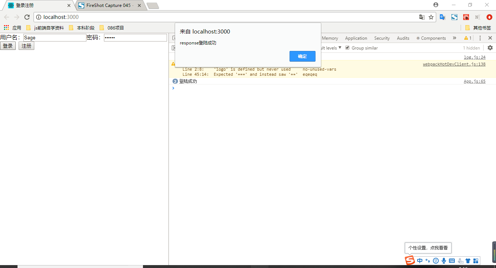

# 2020/10/11

#### 1. 任务规定

* [x] react前台登录注册

* [x] 前后台交互

* [x] 数据库连接

#### 2. 完成情况

#### 3. 自我总结

我觉得我ES6还有好多不清楚的地方，我还是得需要再看看基础~~

#### 4. 下周任务

antd+前后台表单逻辑判断+前后端分层...

---

# 2020/10/17

### 1. 本周任务

* [x] 实现前台登录、注册分离
* [x] 后台实现业务逻辑分离
* [x] 前后台表单验证

### 2. 完成情况

##### (1) 实现前台登录、注册分离

##### （2）后台实现业务逻辑分离

##### （3）完成效果

### 3. 总结

（留坑等填---）

[promise+await+异步任务](https://www.jianshu.com/p/ad70c9c36c22)

### 4. 下周任务

#### ES6

* 定义变量
* 模板字符串
* 对象解构
* 命名方式要注意：文件和变量名都用小驼峰（userName），组件文件或者class用大驼峰（UserName）
  * 前端
    * 用到且学会`flex`布局 [教学](http://www.ruanyifeng.com/blog/2015/07/flex-grammar.html)
  * 后端
    * 密码使用`md5`加密保存 -> 因为`md5`单向加密,所以判断的逻辑是, 前端用md5加密发送加密字符串, 后端读出来 判断是否相等即可. 保存的也是md5加密后的字符串.

